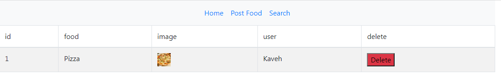

# Mini Food App

In this project I made an Express based recipe app which allows the users of the app to post food recipes. Users of the app are required to register and login to post the recipes along with their ingredients, instructions and an image. This app has a search facility which allows visitors of the website to find recipes based on input ingredients. The admin of the website has its own route that gives it special previleges such as deleting the recipies. This app uses MySQL as the backend storage for storing user tables and interacts with it through sequelize. 
Other noteworthy npm packages used in this app are:
* node-localstorage: used for storing each user's recipes and the sessions that keep track of the users. The login session is terminated when the user logs out.
* passport: used for authenticating users
* multer: used for uploading images
* connect-flash: used for notifying users of their login status

Below are snapshots of the project.

#
Admin route

## Instructions

1. Install MySQL server.
2. Create your desired database in MySQL server.
3. In the config.json file (located in config folder), specify the database you have created in the development section.
4. Install the Node.js dependencies by using the "npm install" command and run "node server.js".
5. The users table will be created in the database and the app will start.
6. Make sure you are connected to MySQL database when running the app.

## Usage
This app provides visitors with the recipes posted by different users and allows them to search recipes by ingredients.

## Tests
This app was tested manually.

## Future
More features such as allowing the user to modify their recipes and adding input validations during user registration will be made in the future.
